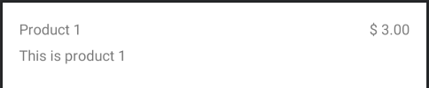

# Choco Droid Live Code
 
 Clone the repository
 
 Create a simple application that consist in show a list of products returned from the API
 
 
 The list's items should look like the image below:



The api response:

```JSON
[
    {
        "Id": "5e8c3c48-af49-425b-a6d9-f37f3511e4fa",
        "name": "Product 1",
        "Description": "This is product 1",
        "price": 100,
        "photo": "http://xyz.com/prod1.jpg"
    },
    {
        "Id": "5e8c3c48-af49-425b-a6d9-f37f3521e4fa",
        "name": "Product 2",
        "Description": "This is product 2",
        "price": 200,
        "photo": "http://xyz.com/prod2.jpg"
    },
    {
        "Id": "5e8c3c48-af49-425b-a6d9-f37f3531e4fa",
        "name": "Product 3",
        "Description": "This is product 3",
        "price": 300,
        "photo": "http://xyz.com/prod3.jpg"
    }
]
```

Feel free to use any third part library you are familiar with.
